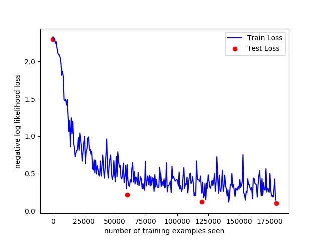

PyTorch MNIST Tutorial
======================

This repo contains a convolutional neural network that can be trained to 
extract features from MNIST data and recognize images. All code is based
on the following tutorial:
https://nextjournal.com/gkoehler/pytorch-mnist

### Usage

To download MNIST data and train the neural network:

```bash
python run_neural_net.py
```

To graph the data:
```bash
python graph.py out/loss_data_20190610_T18:55:25.json
```


Example output:  
  



To continue training:
```bash
python run_neural_net_ctd.py out/loss_data_20190610_T18:55:25.json
```
